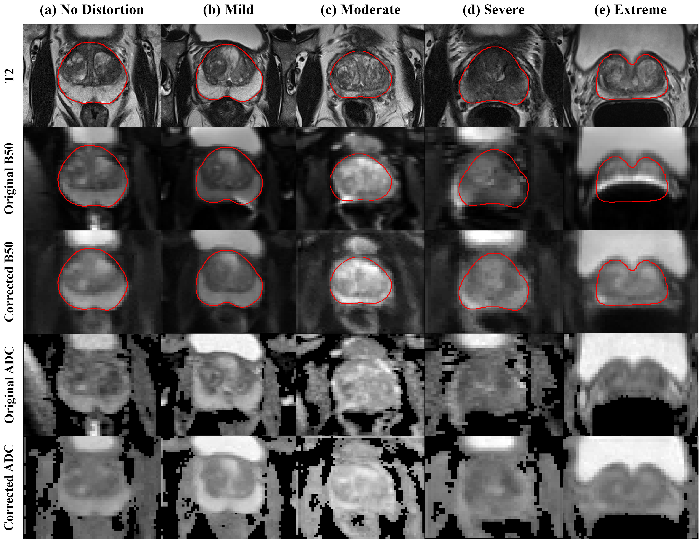

# DeDistortNet

🔥 Official implementation of "Dual-conditioned diffusion model with anatomical guidance for geometric distortion correction in prostate MRI" (European Radiology Experimental)


## Method

DeDistortNet corrects geometric distortions in prostate DWI by combining two conditioning signals in a latent diffusion framework:

- **Contextual conditioning** -- CLIP image encoder extracts DWI signal features (intensities across b-values) from the distorted input.
- **Structural conditioning** -- ControlNet encodes the T2-weighted image as anatomical reference to guide geometric correction.

Trained exclusively on undistorted DWIs with simulated distortions (elastic deformation + Jacobian intensity adjustment, AP-axis scaling, rotation, translation). No paired distorted-undistorted data required.


## Results



## Project Structure

```
source/
  PROSTATEx_convert_dicom2nifti.ipynb  # DICOM to NIfTI conversion
  PROSTATEx_preprocessing.ipynb        # Resampling, registration, per-slice export
  PROSTATEx_setting_dataset.ipynb      # Dataset split and metadata generation
  train_DeDistortNet.py                # Training script
scripts/
  run_train.sh                         # Training launch script
data/preprocessed/
  distortion_severity_labeling.json    # Manually annotated distortion severity labels
  data_split.json                      # Train/val/test split
  train_min_max.json                   # Normalization parameters
```

## Requirements

- Python 3.8+
- PyTorch
- Diffusers (Stable Diffusion, ControlNet)
- Accelerate
- Transformers (CLIP Vision Encoder)
- SimpleITK, pydicom
- elasticdeform, scikit-image
- torchmetrics, wandb

## Data

Uses the public [PROSTATEx dataset](https://www.cancerimagingarchive.net/collection/prostatex/) from TCIA.

### Provided metadata

The following files are included in `data/preprocessed/` for reproducibility:

| File | Description |
|---|---|
| **`distortion_severity_labeling.json`** | **Slice-level distortion severity labels (0--4), manually annotated.** This is the key annotation for dataset stratification and evaluation. |
| `data_split.json` | Train (*n*=135) / validation (*n*=4) / test (*n*=189) split by patient |
| `train_min_max.json` | Per-modality min/max from training set prostate regions |

Distortion severity scale:

| Label | Severity | Boundary mismatch |
|---|---|---|
| 0 | No distortion | -- |
| 1 | Mild | < 2 mm |
| 2 | Moderate | 2--4 mm |
| 3 | Severe | 4--6 mm |
| 4 | Extreme | > 6 mm |

### Preparation pipeline

1. **DICOM to NIfTI** (`PROSTATEx_convert_dicom2nifti.ipynb`) -- Convert DICOM to NIfTI by patient and modality (T2, ADC, HBV, per-b-value DWI).
2. **Preprocessing** (`PROSTATEx_preprocessing.ipynb`) -- Resample to 0.5 x 0.5 x 3 mm, export 2D slices.
3. **Dataset setup** (`PROSTATEx_setting_dataset.ipynb`) -- Attach severity labels, crop coordinates, distortion pivots. Export train/val/test JSONL.

## Training

```bash
bash scripts/run_train.sh
```

Key arguments:

| Argument | Default | Description |
|---|---|---|
| `--pretrained_model_name_or_path` | -- | Stable Diffusion 2.1 base |
| `--image_encoder_path` | -- | CLIP ViT-H image encoder |
| `--resolution` | 512 | Input resolution |
| `--displacement_rate` | 32 | Distortion simulation grid factor |
| `--random_y_squeeze_rate` | 0.1 | AP-axis squeeze range |
| `--random_rotation_degree` | 15 | Rotation augmentation (degrees) |
| `--learning_rate` | 1e-5 | AdamW learning rate |
| `--train_batch_size` | 4 | Batch size per device |

## Trained Weights

Trained DeDistortNet weights (UNet, ControlNet, image encoder) can be downloaded here: [Download link](https://drive.google.com/file/d/1LVxFb58IhxO0bV1tCqCFwZYtRslgwwn1/view?usp=sharing)

## Citation

```bibtex
@article{na2026dual,
  title={Dual-conditioned diffusion model with anatomical guidance for geometric distortion correction in prostate MRI},
  author={Na, Inye and Miao, Qi and Kim, Jonghun and Sung, Kyunghyun and Park, Hyunjin},
  journal={European Radiology Experimental},
  volume={10},
  number={1},
  pages={66},
  year={2026},
  publisher={Springer}
}
```
